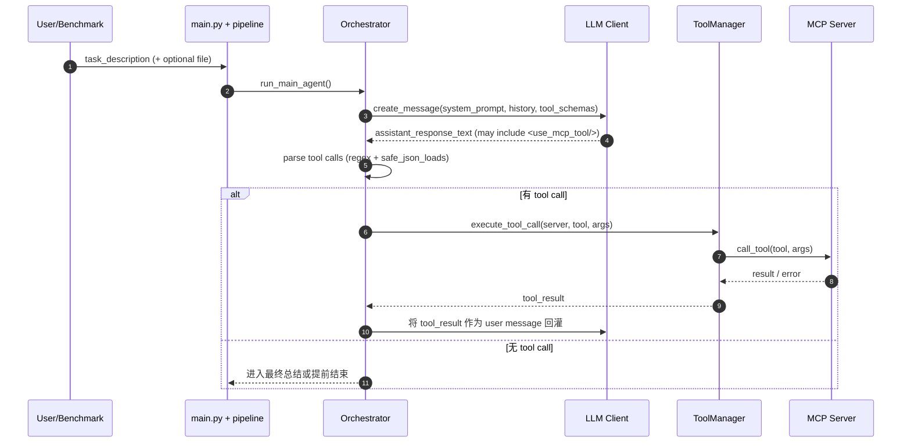
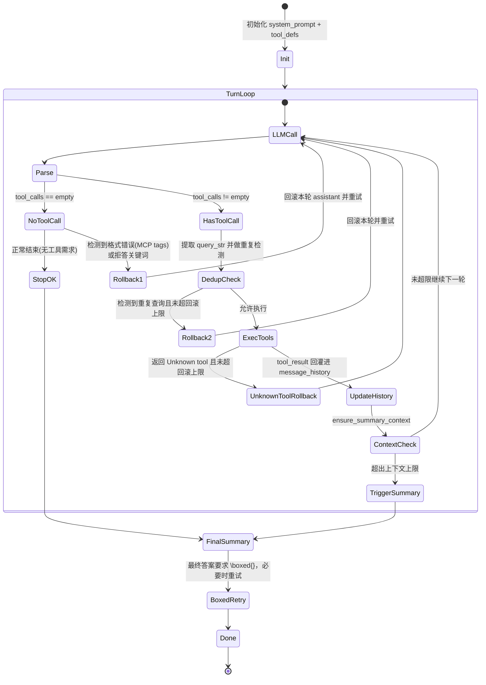
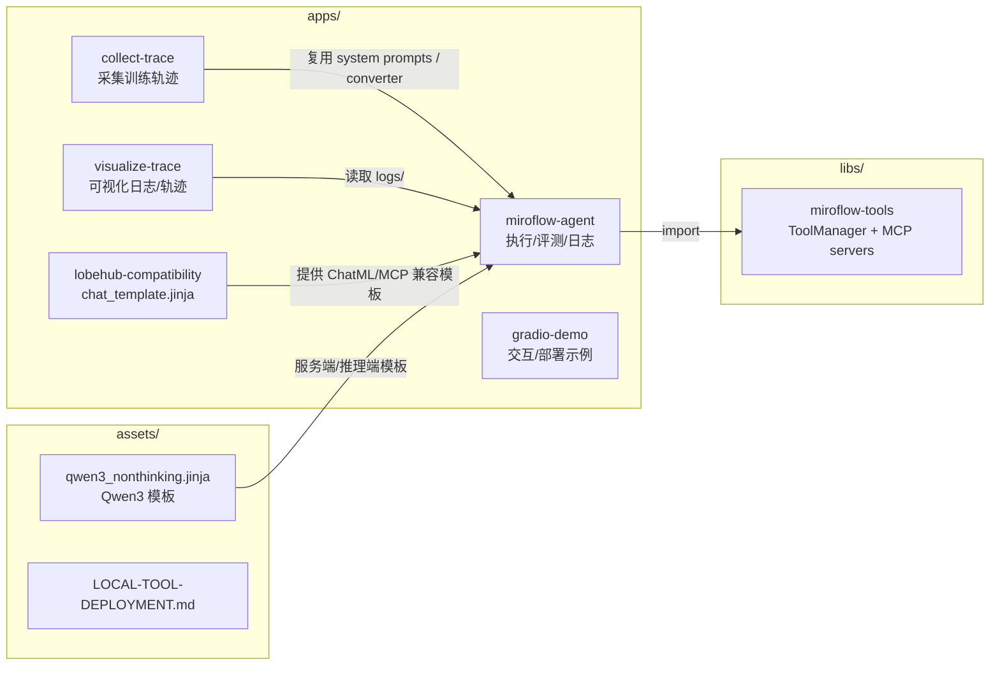
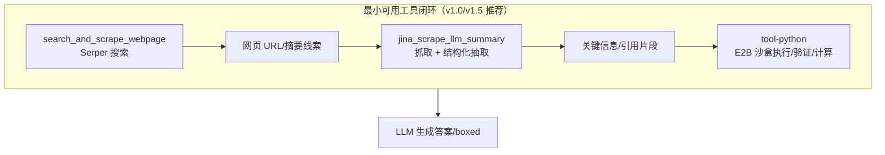

# Mermaid：流程/控制流 + 组件/视图（GitHub 可直接渲染）

> 本文所有图均使用 GitHub 支持的 Mermaid fenced code block：```mermaid

---

## 1) 端到端执行流程（从 `main.py` 到最终答案）

```mermaid
flowchart TD
  U[用户输入 / benchmark item] -->|Hydra 配置| MAIN[apps/miroflow-agent/main.py]

  MAIN --> PIPE[core/pipeline.execute_task_pipeline]
  PIPE --> LOG[TaskLog: 创建 + 记录 env/config]
  PIPE --> LLM[ClientFactory: OpenAIClient/AnthropicClient]
  PIPE --> TM[ToolManager: 连接 MCP servers]
  PIPE --> ORCH[Orchestrator.run_main_agent]

  ORCH -->|生成 system_prompt(含 tools schema)| SP[utils/prompt_utils.generate_mcp_system_prompt]
  ORCH --> LOOP{{主循环\nLLM ↔ Tools}}

  LOOP -->|LLM 返回文本 + 可能的 tool call| PARSE[utils/parsing_utils.parse_llm_response_for_tool_calls]
  PARSE -->|无 tool call 且满足停止条件| FINAL[最终总结/boxed]
  PARSE -->|有 tool call| CALL[ToolManager.execute_tool_call]

  CALL --> MCP[(MCP Server)]
  MCP --> EXT[(外部服务/环境\nSerper / Jina / E2B / ...)]
  EXT --> RESULT[tool result]
  RESULT --> FMT[OutputFormatter.format_tool_result_for_user]
  FMT -->|作为 user message 回灌| LOOP

  FINAL -->|summary prompt\n强制 \\boxed{}| OUT[Final summary + boxed answer]
  OUT --> SAVE[保存日志到 logs/]
```

---

## 2) 单轮交互的时序图（“一次工具调用”）



---

## 3) Orchestrator 主循环的“控制流/防护栏”（回滚、去重、上下文上限）



---

## 4) 仓库“组件/视图”图（从目录理解责任边界）



---

## 5)（可选）工具生态视角：最小闭环（三个 MCP server）



